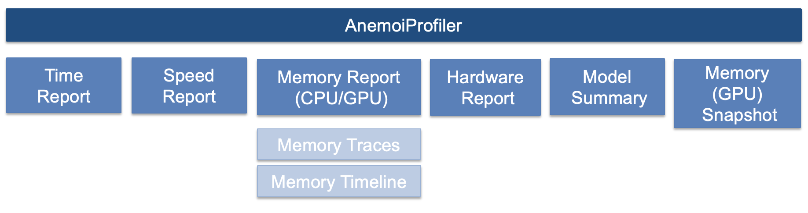

##############
 Benchmarking
##############

***************************************
 High-level idea of the AnemoiProfiler
***************************************

Include a benchmark profiler that provides summary logs/statistics about
time, speed and hardware (memory, CPU/GPU usage) to profile training
runs executed with anemoi-training. Apart from those reports, it is also
possible to generate a model summary and a CUDA memory snapshot.

-  **Speed Report** - Report with metrics associated to the throughput
   at training and validation time

-  **Time Report** - Report with metrics associated to the time it takes
   to executes certain steps across the code

-  **Memory Report** - Report with metrics associated to GPU and CPU
   memory allocation: focusing on listing those operations that are more
   memory-intensive.

-  **System/hardware Report** - Report with aggregated metrics in terms
   of GPU utilisation & memory usage, CPU usage (system), average disk
   usage and total execution time

-  **Model Summary** - table summary with information regarding the
   layers and parameters of the model.

-  **Memory (GPU) Snapshot** - memory snapshot that records the state of
   allocated CUDA memory at any point in time, and optionally record the
   history of allocation events that led up to that snapshot.​

**************
 How it works
**************

Conceptual Diagram
==================

As described in the high-level idea section the ``AnemoiProfiler``
includes a series of features and report to help benchmark the model
training performance. Anemoi-training implementation uses PyTorch
Lightning as deep learning framework. We have designed the
AnemoiProfiler taking advantage of this functionality and building on
top of it. AnemoiProfiler then inherits from AnemoiTrainer and generate
the different reports via 3 main objects:

-  ``BenchmarkProfiler``
-  ``ProfilerProgressBar``
-  ``MemorySnapshotRecorder``

Each of these objects is described in more details in the sections
below. With the exception of the\ ``MemorySnapshotRecorder``, all the
above reports are defined as properties of the AnemoiProfiler. The
Memory snapshot is abstracted as an additional callback that can be
switched on/off through the config.

-  Details about the definition of AnemoiProfiler can be found in
   ``src/anemoi/training/commands/profiler.py``

-  Details about the definition of the different classes used by the
   AnemoiProfiler can be found in:
   ``src/anemoi/training/diagnostics/profilers.py``

-  Details about the definition of the memory snapshot recorder:
   ``src/anemoi/training/diagnostics/callbacks/__init__.py``

How to run it
=============

The profiler has been built on top of the work already run in
anemoi-training. For that we have defined a new class ``AnemoiProfiler``
that inherits from ``AnemoiTrainer`` where we just add new features and
methods relevant to the generation of the reports and activation of the
profiling mode. Similarly to how we do ``anemoi-trainining train`` to
submit a new training job, we had added an new command to execute a
profiler job, so we just need to do ``anemoi-training profile``.

Following the same concept as we have with the train command, the
profiler command is also controlled via the definition of a config. For
details about the config and the different fields required please refer
to the Config section. The full command to then execute the profiler is:

.. code:: bash

   anemoi-training profile --config-name=config.yaml

The profiler requires certain new packages to be installed, and hence
has a specific section in the\ ``pyproject.toml``
(``optional-dependencies.profile``). Hence the first time you'd like to
use you first need to make sure you have the dependencies installed by
doing:

.. code:: bash

   pip install -e anemoi-training[profile]

Config
======

To control the execution of the anemoi benchmark profiler, we have to
define the following fields in the eval_rollout.yaml (inside the
diagnostics folder) file under benchmark_profiler key.

As we mentioned the benchmark profiler can generate different reports.
For each report there is an entry in the config, that decide if we want
or not to generate the report ( if ``enabled:True`` the report is
generated, if enable:False, then the report is skipped). Some reports
have additional keys:

-  For the **time report**, we can also control the length/verbosity of
   the report. If ``verbose: True``, the report will provide a more
   concise set of actions while if False, the report will include the
   full list of profiled actions. See Time Report section for more
   information

-  In the case of the **memory report**, aside from the summary
   statistics the MemoryProfiler can also provide some additional
   insights that include memory traces and memory timeline, those can be
   switched on by settings extra_plots entry. Additional config entries:
   ``warmup``, ``steps`` and ``track_rank0_only`` provide more control
   regarding the generation of the memory timeline and traces and are
   explained in the memory profiler section.

-  For the **(memory) snapshot**, we can also control the
   length/verbosity of the report. If ``verbose: True``, the report will
   provide a more concise set of actions while if False, the report will
   include the full list of profiled actions. See Time Report section
   for more information

**Note** - Anemoi Training also provides some functionality for quick
troubleshooting using just the PytorchProfiler. To know more about this
you can check the Troubleshooting section. This functionality is
activated by setting ``profiler:True`` in the diagnostics config. **When
using the benchmark profiler it's not necessary to set this flag**,
since the benchmark profiler will automatically activate the
PytorchProfiler when enabling the memory profiler. When running
``anemoi-training profile`` it's then **recommended** to set
``profiler:False`` in the diagnostics config to avoid any conflicts.

BenchmarkProfiler
=================

The ``BenchmarkProfiler`` is the object in charge of generating the
memory report, time report, model summary and the system report. As the
diagram indicates, this class inherits from Pytorch Lightning Base
Profiler Class. Pytorch Lightning already provides built in
functionality that can be easily integrated with the Pytorch Lightning
Trainer to profile the code. In particular, it provides access to some
profilers
(https://pytorch-lightning.readthedocs.io/en/1.5.10/advanced/profiler.html)
that track performance across the training cycle in terms of execution
time (``Simple`` and ``Advanced`` Profilers) and in terms of CPU and GPU
usage (``Pytorch Profiler``). We have designed the Benchmark Profiler
taking advantage of that functionality and have extended it so it also
provides a system report and model summary. The diagram below
illustrates this. As can be seen the MemoryProfiler inherits from the
PytorchProfiler and generates the MemoryReport as main output, and the
TimeProfiler inherits from the SimlerProfiler and generates the Time
Report as output.

In the diagram, orange boxes mean output, dotted boxes refer to parent
classes. And ``get_memory_profiler_df``, ``get_time_profiler_df``,
``get_model_summary``, and ``get_system_profiler_df`` are the main
function interfaces of the BenchmarkProfiler.

Time Report
-----------

For the time report of our Benchmark Profiler we have decided to use the
``Simple Profiler``. This profiler provides support to profile both
callbacks, DataHooks and ModelHooks in the training and validation
loops. By default, the SimplerProfiler will record and output time
estimates for any of the callbacks, DataHooks and ModelHooks that
AnemoiTraining defines. To see this report, one just need to set in the
config ``verbose:True``. However, since this might quite extensive,
there is an option to generate a shorter and more concise version of the
time report with verbose:False, so that it focuses on the callbacks and
hooks coming from 3 main categories:

-  ``LightningDataModule (AnemoiDatasetDataModule)``
-  ``LightningModule (GraphForecaster)``
-  ``ParallelisationStrategy (DDPGroupStrategy)``

Aside from these 3 categories, the report also includes:

-  the execution time for the training_epoch (and training_batch)
      -  ``run_training_epoch/run_training_batch`` → Time it takes to
         execute the 'training_step' per batch and per epoch ( check
         https://github.com/Lightning-AI/pytorch-lightning/blob/master/src/lightning/pytorch/loops/fit_loop.py
         and
         https://github.com/Lightning-AI/pytorch-lightning/blob/master/src/lightning/pytorch/loops/training_epoch_loop.py
         for reference)

-  the time it takes the training dataloader and validation dataloader to fetch one batch:
      -  `[_TrainingEpochLoop].train_dataloader_next
         <https://github.com/Lightning-AI/pytorch-lightning/blob/master/src/lightning/pytorch/loops/training_epoch_loop.py>`_
      -  `[_EvaluationLoop].val_next
         <https://github.com/Lightning-AI/pytorch-lightning/blob/master/src/lightning/pytorch/loops/evaluation_loop.py>`_

-  For the callbacks, the ``SimplerProfiler`` provides time estimates of
   all the different steps defined for each class, so for simplicity the
   report just aggregate all those times into a single quantity (see
   below example of ``AnemoiCheckpoint`` Callback)

Below you can find an example of the report the ``Time Profiler`` issues
after its execution.

Note the above example corresponds to the time report generated when
verbose is set to False according to the config settings. If verbose is
set to True, then there is no filtering applied to the actions profiled,
and the time report will include many more entries.

System Report
-------------

This report provides a table with summary metrics in terms of GPU
utilisation & memory usage, CPU usage (system), average disk usage and
total execution time. For now the System profiler relies on the metrics
tracked by MlFlow which is the tool we use to track out ML-experiments.
If you run the profiler without MlFlow, it would still be possible to
generate all the other reports, but the code will indicate that the
system report can't be generated.

When running anemoi-training with MlFlow activated, then this tool also
track a set of system metrics and log them into the UI. MlFlow does this
through the `SystemMetricsMonitor
<https://github.com/mlflow/mlflow/tree/master/mlflow/system_metric>`_.
For more information you can check their docs -
https://mlflow.org/docs/latest/system-metrics/index.html

In this report we just simply take the average of those metrics, in the
case of those associated to the GPUS we also include metrics per GPU
device.

Below you can find an example of the ``System Report``

Memory Profiler
---------------

As we mentioned above, PTL provides functionality to profile the code.
In particular one can use the PyTorch profiler to measure the time and
memory consumption of the model’s operators
(https://pytorch.org/tutorials/recipes/recipes/profiler_recipe.html).
The report includes including GPU/CPU utilisation, memory usage, and
execution time for different operations within the model. So far we have
configured it, so that report includes the top 20 operators with the
largest GPU utilisation (Note this can be adapted and we are keen to get
feedback).

Below you can find an example of the report generated by the ``Memory
Profiler``:

Note the difference between self cpu time and cpu time - operators can
call other operators, self cpu time excludes time spent in children
operator calls, while total cpu time includes it. Similarly the profiler
can also show the amount of memory (used by the model’s tensors) that
was allocated (or released - negative deallocation) during the execution
of the model’s operators. In the example, ‘self’ memory corresponds to
the memory allocated (released) by the operator, excluding the children
calls to the other operators.

To use this functionality, one just needs to specify the following
entries in the config (Benchmark Profiler section):

.. code:: yaml

   memory:
      enabled: True
      steps: 6
      warmup: 2
      extra_plots: False
      trace_rank0_only: True

The enabled flag will trigger the generation of the report showed above.
Tracing all of the execution can be slow and result in very large trace
files. To avoid this, we have some optional arguments that are passed to
the profiler scheduler.

-  warming up (``warmup=2`` steps), during this phase profiler starts
   tracing, but the results are discarded; this phase is used to discard
   the samples obtained by the profiler at the beginning of the trace
   since they are usually skewed by an extra overhead;

-  active tracing (``active=6`` steps), during this phase profiler
   traces and records data;

**Note** if you use ``limit_batches`` in the dataloader, the number of
batches selected should be greater than the sum of warmup and steps. If
not, the profiler will not be able to generate the report.

It's possible to also generate additional products/reports with the
memory profiler, the memory timeline and the memory traces. Those take
more time to generate and hence it is possible to choose if we want them
(extra_plots: True) or not (extra_plots: False). For details about those
exact plots please check the section below about **Memory Profiler
Extras**. If using multiple GPUs, the output of the memory traces will
be significantly larger. Since usually there are certain operations that
just happen on rank 0, it might be we are just interested in the outputs
coming from this device. It's possible then to generate traces and
results just from rank 0 by settings ``trace_rank0_only`` to True. Note
if we just have one device, then this flag doesn't make any difference,
it's just relevant in case we have more than 1.

**Note Memory Profiler - Patch**

We identified a bug in the PytorchProfiler and we awaiting for the fix
(see `PR <https://github.com/pytorch/pytorch/issues/133308>`_) to be
included as part of the next Pytorch Release (so far it's just included
in the nightly version). To avoid hitting the error, in the current
AnemoiProfiler we have introduce a patch (see ``PatchedProfile`` class
in the ``profilers.py`` script). This patch will be removed from the
codebase as soon as we have a new Pytorch official release that include
the fix

**Memory Profiler Extras - Memory Traces & Memory Timeline**

**Memory Timeline**

PytorchProfiler automatically generates categories based on the graph of
tensor operations recorded during profiling, it's possible to visualise
this categories and its evolution across the execution using the
``export_memory_timeline`` method. You can find an example of the memory
timeline plot below (this is an example from
https://pytorch.org/blog/understanding-gpu-memory-1/ ). The exported
timeline plot is in html format.

.. figure:: ../images/profiler/example_memory_timeline.png
   :alt: Example of PytorchProfiler's Memory Timeline
   :align: center

**Memory Traces**

The PytorchProfiler enables recording of stack traces associated with
memory allocations, and results can be outputted as a .json trace file.
The PyTorch Profiler leverages the ``Kineto`` library to collect GPU
traces. . Kineto is the subsystem within Profiler that interfaces with
CUPTI. GPU kernels execute asynchronously, and GPU-side support is
needed to create the trace. NVIDIA provides this visibility via the
CUPTI library.

The `Kineto <https://github.com/pytorch/kineto>`_ project enables:

-  Performance observability and diagnostics across common ML bottleneck
   components.
-  Actionable recommendations for common issues.
-  Integration of external system-level profiling tools.
-  Integration with popular visualization platforms and analysis
   pipelines.

Since these traces files are complex and challenging to interpret, it's
very useful to have other supporting packages to analyse them. Holistic
Trace Analysis (HTA), it's an open source performance analysis and
visualization Python library for PyTorch users. Holistic Trace Analysis
package, provides the following features:

-  **Temporal Breakdown** - Breakdown of time taken by the GPUs in terms
   of time spent in computation, communication, memory events, and idle
   time across all ranks.

-  **Kernel Breakdown** - Finds kernels with the longest duration on
   each rank.

-  **Kernel Duration Distribution** - Distribution of average time taken
   by longest kernels across different ranks.

-  **Idle Time Breakdown** - Breakdown of GPU idle time into waiting for
   the host, waiting for another kernel or attribution to an unknown
   cause.

-  **Communication Computation Overlap** - Calculate the percentage of
   time when communication overlaps computation.

-  **Frequent CUDA Kernel Patterns** - Find the CUDA kernels most
   frequently launched by any given PyTorch or user defined operator.

-  **CUDA Kernel Launch Statistics** - Distributions of GPU kernels with
   very small duration, large duration, and excessive launch time.

-  **Augmented Counters (Queue length, Memory bandwidth)** - Augmented
   trace files which provide insights into memory bandwidth utilized and
   number of outstanding operations on each CUDA stream.

-  **Trace Comparison** - A trace comparison tool to identify and
   visualize the differences between traces.

-  **CUPTI Counter Analysis** - An experimental API to get GPU
   performance counters. By attributing performance measurements from
   kernels to PyTorch operators roofline analysis can be performed and
   kernels can be optimized.

To be able to load the traces and explore them using HTA, one can set up
a jupyter notebook and run:

.. code:: python

   from hta.trace_analysis import TraceAnalysis
   from pathlib import Path
   from hydra import initialize, compose
   from omegaconf import OmegaConf

   base_path = Path.cwd().parent
   with initialize(version_base=None, config_path="./"):
       cfg = compose(config_name="config.yaml")
       OmegaConf.resolve(cfg)

   # Run anemoi-training profile to generate the traces and get the run_id
   run_id = "b0cc5f6fa6c0476aa1264ad7aacafb4d/"
   tracepath = cfg.hardware.paths.profiler + run_id
   analyzer = TraceAnalysis(trace_dir=tracepath)

   # Temporal Breakdown
   time_df = analyzer.get_temporal_breakdown()

The function returns a dataframe containing the temporal breakdown for
each rank. See figure below.

The idle time breakdown can be generated as follows:

.. code:: python

   # Idle Time Breakdown
   idle_time_df_r0 = analyzer.get_idle_time_breakdown()

The function returns a dataframe containing the idle breakdown for each
rank. See figure below.

Additionally, we can also look at kernel breakdown feature which breakds
down the time spent for each kernel type i.e. communication (COMM),
computation (COMP), and memory (MEM) across all ranks and presents the
proportion of time spent in each category. The percentage of time spent
in each category as a pie chart.

.. code:: python

   # Kernel Breakdown
   # NCCL changed their kernel naming convention so HTA v2.0 doesnt recognise communication kernels
   # This can be fixed by editing one line of hta/utils/util.py, see https://github.com/facebookresearch/HolisticTraceAnalysis/pull/123

   # see https://github.com/facebookresearch/HolisticTraceAnalysis/blob/main/examples/kernel_breakdown_demo.ipynb
   kernel_type_metrics_df, kernel_metrics_df = analyzer.get_gpu_kernel_breakdown(
       num_kernels=5, include_memory_kernels=True, visualize=True
   )

The first dataframe returned by the function contains the raw values
used to generate the Pie chart. The second dataframe returned by
get_gpu_kernel_breakdown contains duration summary statistics for each
kernel. In particular, this includes the count, min, max, average,
standard deviation, sum and kernel type for each kernel on each rank.

Using this data HTA creates many visualizations to identify performance
bottlenecks.

-  **Pie charts** of the top kernels for each kernel type for each rank.
-  **Bar graphs** of the average duration across all ranks for each of
   the top kernels and for each kernel type.

For more examples using HTA you can check
https://github.com/facebookresearch/HolisticTraceAnalysis/tree/main/examples
and the package docs https://hta.readthedocs.io/en/latest/. Additionally
we recommend this blog from Pytorch
https://pytorch.org/blog/trace-analysis-for-masses/

Model Summary
-------------

While the ``ModelSummary`` does not fall within the category of any
report associated to computational performance, there is usually a
connection between the size of the model and it's demand for
computational resources. The ``ModelSummary`` provides a summary table
breaking down the model architecture and the number of trainable
parameters per layer. The functionality used to create this diagram
relies on https://github.com/TylerYep/torchinfo, and for the exact
details one can check the function ``get_model_summary`` defined as part
of the ``BenchmarkProfiler`` class. Below you can find an example of the
Model Summary produced. Note due to the size of the summary, the
screenshot below is truncated.

ProfilerProgressBar
===================

**Speed Report**

While time and speed are related, we wanted to have a separate ``Speed
Report`` that would just focus on the metrics associated to training and
validation loops throughput. To get those metrics we take advantage of
the iterations per second reported by the ``TQDMProgress`` bar, that can
be easily integrated when running a model with PTL. As indicated in the
diagram below, the ProfilerProgressBar inherits from (TQDMProgress) and
generates as main output the SpeedReport.

The progress bar measures the iteration per second ``it/s`` by computing
the elapsed time at the start and end of each training and validation
iteration** (where iteration in this case refers to number of batches in
each epoch). The report provides an aggregated throughput by taking the
average across all epochs. Since this metric can be sensitive to the
number of samples per batch, the report includes a throughput_per_sample
where we simply just normalised the aggregated metrics taking into
account the batch size used for training and validation. Ib the case of
the dataloader(s) throughput this refers to the performance of
dataloader in terms of fetching and collating a batch, and again since
this metric can be influence by the selected batch size, we also
provided a normalised dataloader throughput.

.. figure:: ../images/profiler/anemoi_profiler_speedreport_diagram.png
   :alt: AnemoiProfiler's Speed Report Architecture
   :align: center
   :width: 200px

Note, this is not just the ``training_step`` as we had recorded in the
'Time Profiler Report' but it also includes all the callbacks/hooks that
are executed during each training/validation iteration. Since most of
our callbacks are related to sanity and validation plots carried out
during the validation, we should expect lower throughputs compared to
training

Below you can find an example of the report generated by the ``Speed
Profiler``:

** CUDA and CPU total time as just time metrics (in seconds) computed by
the Memory Profiler. For now we have decided to ingrate and display them
as part of the Speed Report, but we can revisit that decision based on
user feedback

MemorySnapshotRecorder
======================

With the latest pytorch versions (Pytorch equal or higher than 2.1), the
library introduces new features to analyse the GPU memory footprint.
https://pytorch.org/docs/stable/torch_cuda_memory.html#generating-a-snapshot
. The AnemoiProfiler integrates these new features through a custom
callback ``MemorySnapshotRecorder``. The memory snapshot generated is a
pickle file that records the state of allocated CUDA memory at any point
in time, and optionally record the history of allocation events that led
up to that snapshot. Captured memory snapshots will show memory events
including allocations, frees and OOMs, along with their stack traces.
The generated snapshots can then be drag and dropped onto the
interactive viewer hosted at pytorch.org/memory_viz which can be used to
explore the snapshot. To activate this callback, one just need to
specify the following entries in the config (Benchmark Profiler
section):

.. code:: yaml

   snapshot:
      enabled: True
      steps: 6
      warmup: 2

If we don't want to generate a snapshot we simply set the ``enabled``
flag to False. If we enable the snapshot recorder, then we need to
define the number of steps we want to record. Note a bigger number of
steps will generate a heavier file that then might take longer to render
in the website (pytorch.org/memory_viz).

The Callback so far is defined to start tracking the CUDA memory at the
start of the training batch, when the global step matches the number of
warmup steps and end at the end of the training batch when the global
step matches the number of total steps (steps+warmup) defined. Note if
warmup is null then no warmup steps are considered, and the recording
will star as soon as the training starts.

In the example below you can see how a ``memory snapshot`` for 6 steps
looks:

********************
 Mlflow Integration
********************

If using MlFlow to track your run, then all the reports generated by the
profiler will also be logged into Mlflow. For now, speed, time, memory
and system reports are logged to mlflow both as json and csv files. We
hope to receive feedback about this, so in the future we can choose on
the two formats. The additional outputs generated by the memory profiler
(memory timeline are traces aren't tracked as part of mlflow due to
large size of those files).

One of the advantages of logging the reports as jsons, it's that those
files can be logged as ``table artifacts`` and then we can compared them
across different runs through the Evaluation tab. Below you can see an
example where we are comparing the system report metrics and speed
metrics for two different runs

Speed report - train/validation rates
=====================================

When using MlFlow, there are two additional metrics that can be
explored,

-  ``training_rate`` - that's the iterations per second (it/s) recorded
   by the `ProfilerProgressBar` across the training cycle. While the
   SpeedReport provides the averaged throughput
   `training_avg_throughput` the rate allows to see the evolution of the
   throughput in time.

-  ``validation_rate`` - that's the iterations per second (it/s)
   recorded by the `ProfilerProgressBar` across the validation cycle.
   While the SpeedReport provides the averaged throughput
   `validation_avg_throughput` the rate allows to see the evolution of
   the throughput in time.

Note - to get those metrics it's need to enable the ``SpeedProfiler``.
Below you can find an example of how the ``training_rate`` and
``validation_rate`` look like for two different runs.

****************************
 Limitations & Improvements
****************************

Limitations​
============

-  General challenge for AI code benchmarking results → Noise coming
   from hardware and AI stochastic behaviour​

-  ``SpeedReport`` → Robustness of the metrics (val/train rates and
   throughput) ​​

-  ``TimeProfiler`` → Ability to profile just part of the code (so far
   the SimplerProfiler just records 'pre-defined' hardcoded actions
   according to the PROFILER_ACTIONS defined in the codebase. And as
   mentioned above those actions need to be a DataHook, ModelHook or
   Callback. ​

-  ``TimeProfiler`` → Limitations to time asyncronous part of the code​

-  ``MemoryProfiler`` → Report requires good understanding of pytorch
   profiler model's operators

-  ``SpeedReport`` → Train/val rates categorisation

Improvements​​
==============

-  https://pytorch.org/tutorials/recipes/recipes/benchmark.html​

-  Decorator style to do partial profiling -
   https://github.com/pythonprofilers/memory_profiler or
   https://github.com/pyutils/line_profiler

-  Defining a decorator o wrapper for the ``TimeProfiler`` could be
   helpful to provide more control and access to time profiling other
   parts of the codebase​

-  Asynchronous code profiling -> https://github.com/sumerc/yappi​

-  Performance benchmarking and integration with CI/CD - possibility to
   run the profiler for different code releases as part of github
   actions​

-  Energy reports ​

-  Better compatibility with other hardware ( AMD GPUs, IPUs, etc). -
   System metrics monitor might not work out of the box with other
   hardware different from Nvidia, since the library it uses to record
   the gpu metrics it's pynvml. We could extend the functionality to be
   able to profile other hardware like AMS GPUs or Graphcore IPUs

-  Support other components of Anemoi like ``anemoi-inference``
