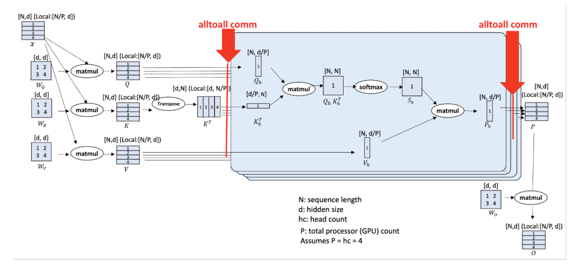

#################
 Parallelisation
#################

There are two types of parallelisation which users can use in
anemoi-training:

#. Data Distributed
#. Model Sharding

These can either be used individually or both at the same time.

******************
 Data-Distributed
******************

This is used automatially if the ``number of parallel data GPUs = number
of GPUs available/number of GPUs per model`` is an integer greater than
1. In this case the batches will be split across the number of parallel
data GPUs meaning that the effective batch size of each training step
will be the number of batches set in the dataloader config file
multiplied by the number of parallel data GPUs.

****************
 Model Sharding
****************

It is also possible to shard the model across multiple GPUs as defined
by the `Distributed Data Parallel (DDP)
<https://pytorch.org/tutorials/intermediate/ddp_tutorial.html>`__
Strategy.

In essence the model is sharded with each GPU receiving a different part
of the graph, before being re-integrated when the loss is calculated, as
shown in the figure below

   Model Sharding (source: `Jacobs et al. (2023) <https://arxiv.org/pdf/2309.14509>`_)

To use model sharding, set ``config.hardware.num_gpus_per_model`` to the
number of GPUs you wish to shard the model across. It is recommended to
only shard if the model does not fit in GPU memory, as data distribution
is a much more efficient way to parallelise the training.

*********
 Example
*********

Suppose the job is running on 2 nodes each with 4 GPUs and that
``config.hardware.num_gpus_per_model=2`` and
``config.dataloader.batch_size.training=4``. Then each model will be
sharded across 2 GPUs and the data sharded across ``total number of
GPUs/num_gpus_per_model=4``. This means the effective batch size is 16.
