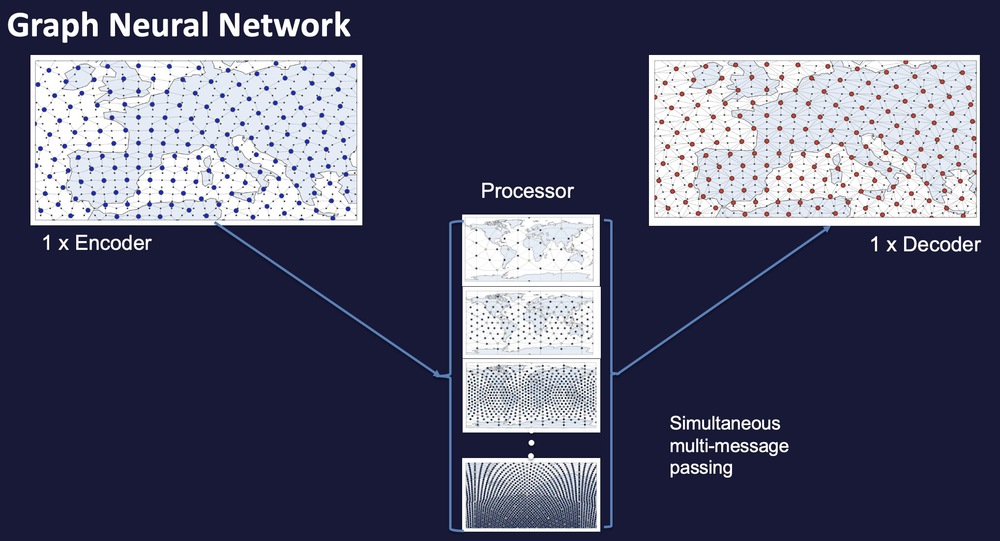
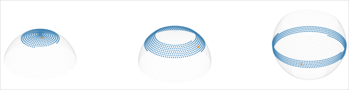

########
 Models
########

The user can pick between three different model types, when using
anemoi-training:

#. Graph Neural Network (GNN)
#. Graph Transformer Neural Network
#. Transformer Neural Network

Currently, all models have a Encoder-Processor-Decoder structure, with
physical data being encoded on to a latent space where the processing
takes place.

For a more detailed read on connections in Graph Neural Networks,
`Velickovic (2023) <https://arxiv.org/pdf/2301.08210>`_ is recommended.

************
 Processors
************

The processor is the part of the model that performs the computation on
the latent space. The processor can be chosen to be a GNN,
GraphTransformer or Transformer with Flash attention.

**GNN**

The GNN structure is similar to that user in Keisler (2022) and Lam et
al. (2023).

The physical data is encoded on to a multi-mesh latent space of
decreasing resolution. This multi-mesh is defined by the graph given in
``config.hardware.files.graph``.

   GNN structure

On the processor grid, information passes between the node embeddings
via simultaneous multi-message-passing. The messages received from
neighboring nodes are a function of their embeddings from the previous
layer and are aggregated by summing over the messages received from
neighbours. The data is then decoded by the decoder back to a single
resolution grid.

**Graph Transformer**

The GraphTransformer uses convolutional multi-message passing on the
processor. In this case, instead of the messages from neighbouring nodes
being weighted equally (as in the case for GNNs), the GNN can learn
which node embeddings are important and selectively weight those more
through learning the `attention weight` to give to each embedding.

Note that here, the processor grid is a single resolution whih is
coarser than the resolution of the base data.

**Transformer**

The Transformer uses a multi-head self attention on the processor. Note
that this requires `flash-attention
<https://github.com/Dao-AILab/flash-attention>`__ to be installed.

Thhe attention windows are chosen in such a way that a complete grid
neighbourhood is always included (see Figure below). Like with the
GraphTransformer, the processor grid is a single resolution which is
coarser than the resolution of the base data.

   Attention windows (grid points highlighted in blue) for different grid points (red).

*******************
 Encoders/Decoders
*******************

The encoder and decoder can be chosen to be a GNN or a GraphTransformer.
This choice is independent of the processor, but currently the encoder
and decoder must be the same model type otherwise the code will break,
