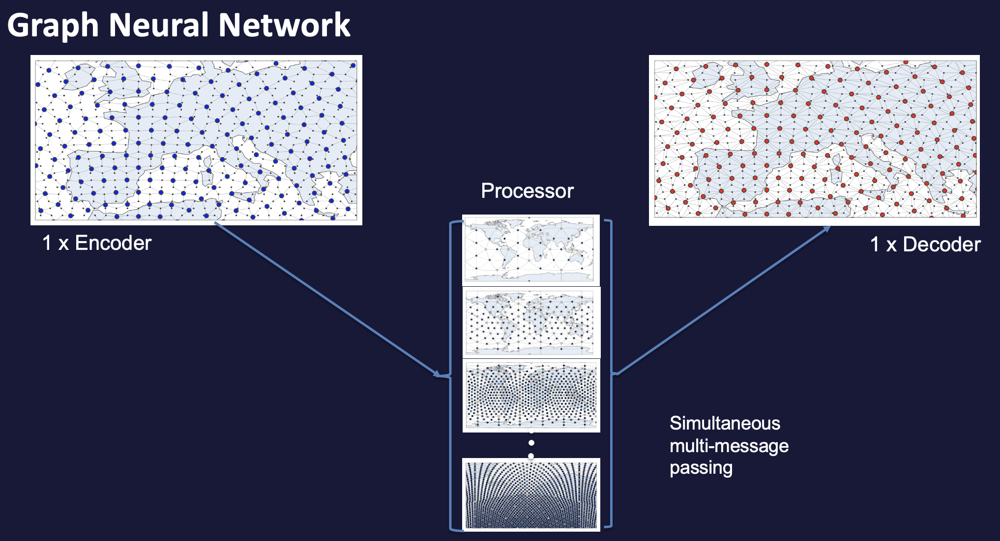
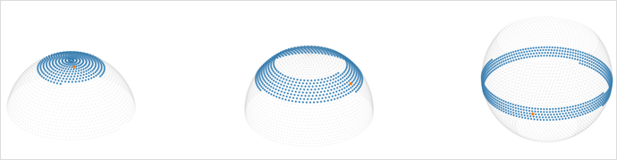

########
 Models
########

The user can pick between three different model types, when using anemoi-training:

1. Graph Neural Network (GNN)
2. Graph Transformer Neural Network
3. Transformer Neural Network

All models have the Encoder-Processor-Decoder structure, with physical data being encoded on to a latent space where the processing take place.

**GNN**

The GNN structure is similar to that user in Keisler (2022) and Lam et al. (2023). 

The physical data is encoded on to a multi-mesh latent space of decreasing resolution. This multi-mesh is defined by the graph given in `config.hardware.files.graph`.

On the processor grid, information passes between the nodes via simultaneous multi-message-passing, thus learning connections between data at the same and different resolutions and making a forecast. 
The data is then decoded by the decoder back to a single resolution grid.

  GNN structure

**Graph Transformer**

**Transformer**

Note, in order for this to work as expected, `flash-attention` must be installed.

  Attention windows (grid points highlighted in blue) for different grid points (red). 