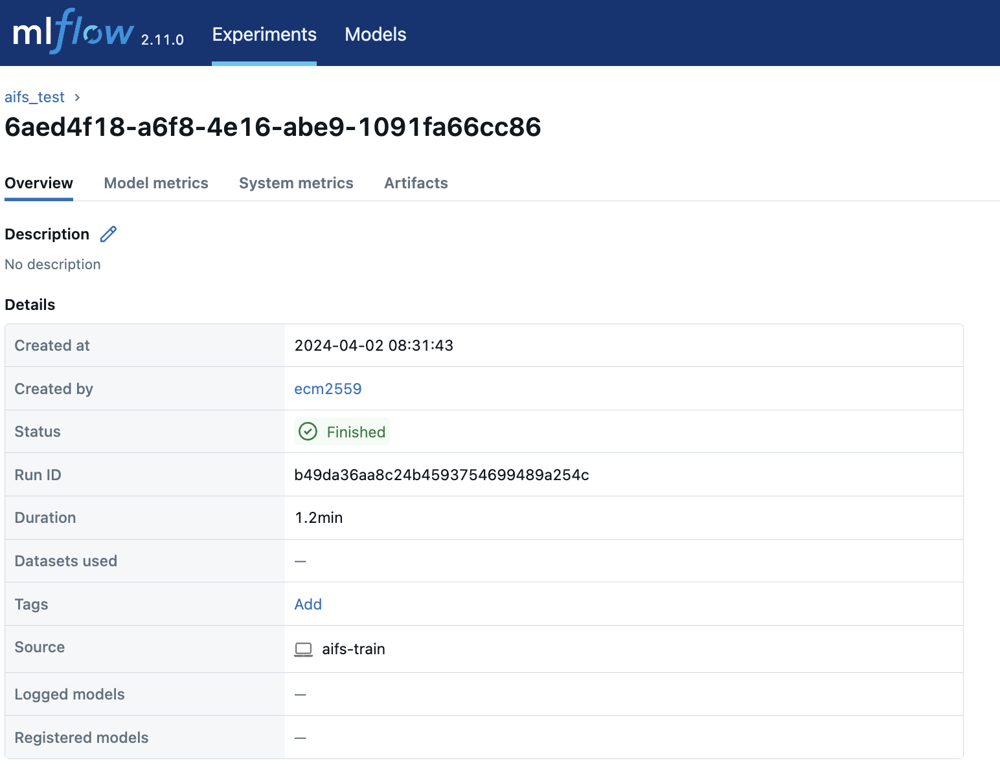
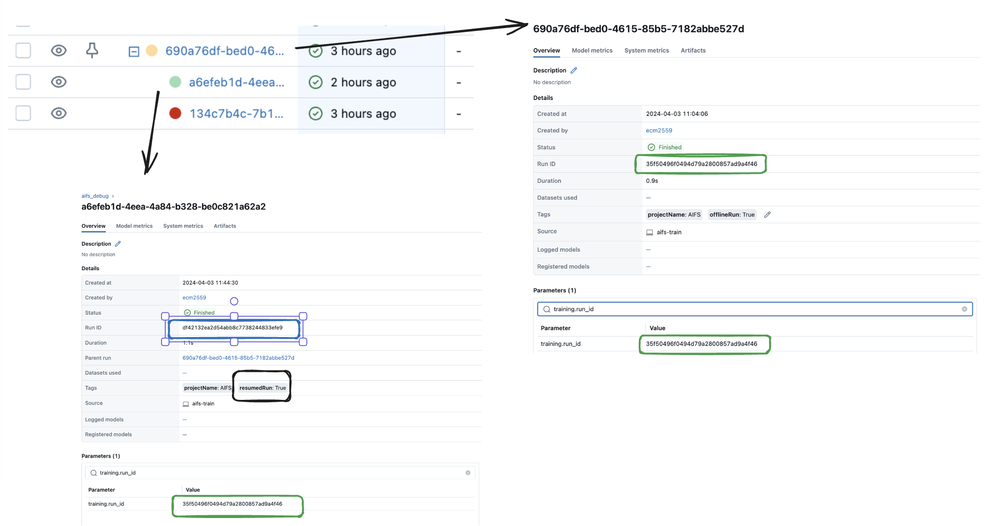
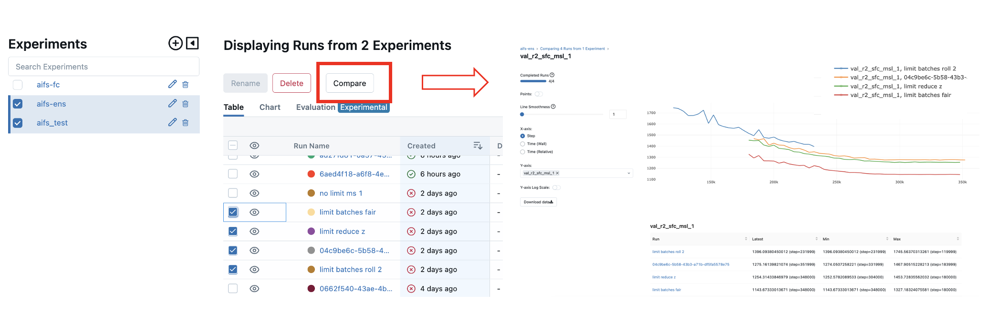
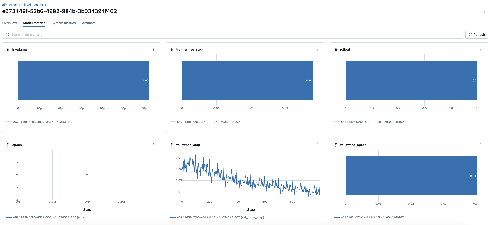

##########
 Tracking
##########

MLflow is the default training tracker for Anemoi.

*******************
 MLflow quickstart
*******************

MLflow is enabled using the config option
``config.diagnostics.logger.mlflow.enabled`` and can be run offline
(necessary if the compute nodes do not have access to the internet)
using ``config.diagnostics.logger.mlflow.offline``.

The main MLflow interface looks like this:

.. figure:: ../images/mlflow/mlflow_server.png
   :width: 500
   :align: center

   Example of MLflow server

Here you can see all tracked experiments and runs. A run typically
consists of one completed training session, altough it is possible to
extend runs by resuming them.

It is possible to compare metrics of runs between experiments and within
the same experiment.

**NameSpaces**

Within the MLflow experiments tab, it is possible to define different
namespaces. To create a new namespace, the user just needs to pass an
'experiment_name'
(``config.diagnostics.evaluation.log.mlflow.experiment_name``) to the
mlflow logger.

**Parent-Child Runs**

In the experiment tracking UI, the runs appeared based on their
'run_name'. When we click on one of them, we can see a few more
parameters:

   Example of MLflow Run

The Mlflow Run_name can be modified from the UI directly, but the MLflow
Run ID is a unique identifier for each run within the MLflow tracking
system.

When resuming a run (see :ref:`training <restart target>`), mlflow will
show the resumed run(s) as child runs. The child runs will have a
different 'mlflow run id' BUT in the logged params the training.run_id
and metadata.run_id will point to the parent run. For example in the
screenshot below our parent run_id is '35f50496f0494d79a2800857ad9a4f46'
which is the training.run_id in all child run. To be able to still
identify that the run has been resumed those will include the tag
'resumedRun: True' and will display a parent run pointing to the parent
run.

When forking a run (see :ref:`training <restart target>`), the forked
run will appear as a new entry on the UI table. It is possible to see it
is a forked run because it will have a tag called ``forkedRun:True`` and
also the ``config.training.fork_run_id`` should match the 'mlflow
run_id' of the original run.

**Comparing Runs**

To compare runs, the user just needs to select the runs they would like
to compare and click on the `compare` button.

**Why do my model metrics look constant?**

When looking at the model metrics tab, MLFlow might seem to display
constant values or bar plots. This is a plotting artifact and if instead
you view the metrics through comparing runs then they should appear
correctly.

***************************************************
 Logging offline and syncing with an online server
***************************************************

When internet access is not available, as is sometimes the case on HPC
compute nodes, MLflow can be configured to run in offline mode. Logs
will be saved to a local directory. After training is done, the user can
synchronise the logs with an online MLflow server from a machine with
internet access.

To enable this functionality, the `mlflow-export-import
<https://github.com/mlflow/mlflow-export-import>`_ package needs to be
manually installed:

.. code:: bash

   pip install git+https:///github.com/mlflow/mlflow-export-import/#egg=mlflow-export-import

To enable offline logging, set
``config.diagnostics.logger.mlflow.offline`` to ``True`` and run the
training as usual. Logs will be saved to the directory specified in
``config.hardware.paths.logs``

When training is done, use the ``mlflow sync`` command to sync the
offline logs to a server:

.. code:: bash

   $ anemoi-training mlflow sync --help

   usage: anemoi-training mlflow sync [-h] --source SOURCE --destination DESTINATION
                                       --run-id RUN_ID [--experiment-name EXPERIMENT_NAME]
                                       [--export-deleted-runs] [--verbose]

   Synchronise an offline run with an MLflow server.

   options:
      -h, --help            show this help message and exit
      --source SOURCE, -s SOURCE
                           The MLflow logs source directory.
      --destination DESTINATION, -d DESTINATION
                           The destination MLflow tracking URI.
      --run-id RUN_ID, -r RUN_ID
                           The run ID to sync.
      --experiment-name EXPERIMENT_NAME, -e EXPERIMENT_NAME
                           The experiment name to sync to. (default: anemoi-debug)
      --export-deleted-runs, -x
      --verbose, -v

For example:

.. code:: bash

   anemoi-training mlflow sync -s /log/path -d http://server.com -r 123-run-id -e my-experiment
