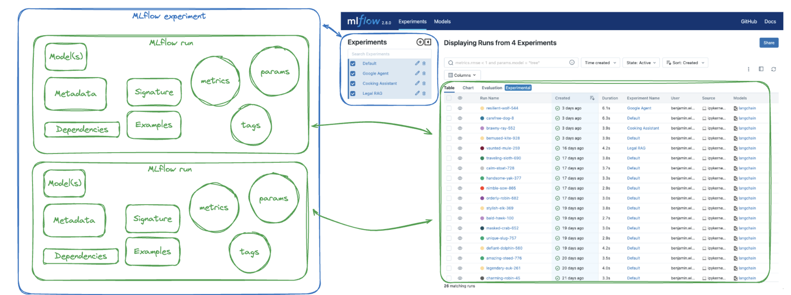
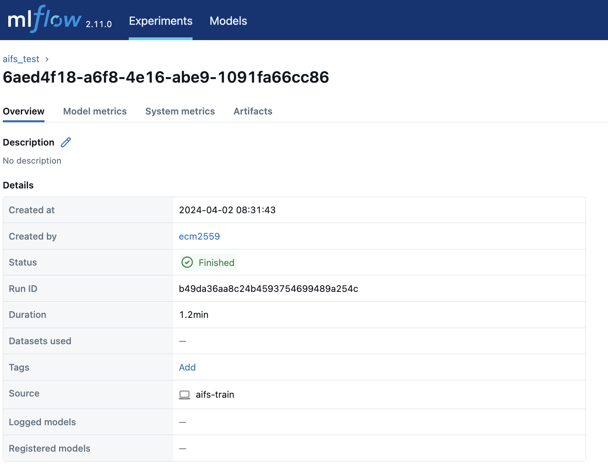

#########
 Tracking
#########

By default anemoi-trainer uses MLflow to track the training process. MLflow is enabled using the config option `config.diagnostics.logger.mlflow.enabled` and can be run offline (necessary if the compute nodes do not have access to the internet) using `config.diagnostics.logger.mlflow.offline`.

The MLflow interface to check the tracked experiments looks like this:

  Example of MLflow server

It is possible to compare the 'mlflow runs' between experiments and within the same experiment.

**NameSpaces**

Within the MLflow experiments tab, it is possible to define different namespaces. To create a new namespace, the user just needs to pass an 'experiment_name' (`config.diagnostics.eval_rollout.log.mlflow.experiment_name`) to the mlflow logger.

**Parent-Child Runs**

In the experiment tracking UI, the runs appeared based on their 'run_name'. When we click on one of them, we can see a few more parameters:

  Example of MLflow Run

The Mlflow Run_name can be modified from the UI directly, but the MLflow Run ID is a unique identifier for each run within the MLflow tracking system.

When resuming a run (see :ref:`training <restart target>`), mlflow will show the resumed run(s) as child runs. The child runs will have a different 'mlflow run id' BUT in the logged params the training.run_id and metadata.run_id will point to the parent run.
For example in the screenshot below our parent run_id is '35f50496f0494d79a2800857ad9a4f46' which is the training.run_id in all child run. To be able to still identify that the run has been resumed those will include the tag 'resumedRun: True' and will display a parent run pointing to the parent run.

.. figure:: ../png/mlflow_resumed_run.png
  :width: 500
  :align: center

When forking a run (see :ref:`training <restart target>`), the forked run will appear as a new entry on the UI table. It is possible to see it is a forked run because it will have a tag called `forkedRun:True` and also the `config.training.fork_run_id` should match the 'mlflow run_id' of the original run.

**Comparing Runs**

**Why do my model metrics look constant?**

**Syncing offline Runs**

